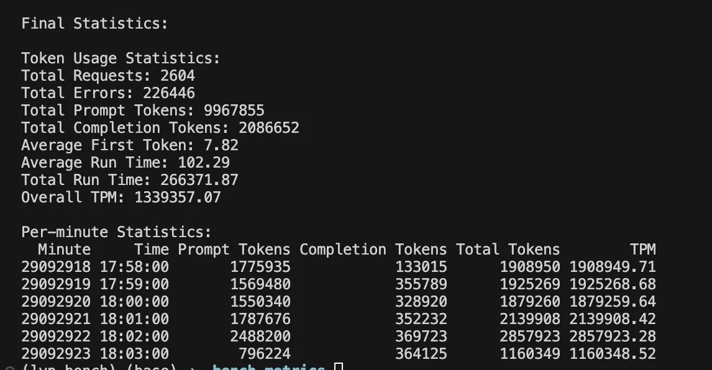

# LLM压测脚本
## 简介
本压测脚本用以测试LLM的TPM，使用python协程并发请求模型。

首先从prompt.json文件中读取单条请求，然后将该请求重复多次，构建prompt列表。

接着，根据设置好的并发开启多个协程，从promt列表中读取prompt并请求模型。每个协程请求结束后，会把统计信息写入到全局的数据结构中。

最后，脚本会输出压测的结果，结果示例如下图所示。

## 使用须知
1.压测使用的是兼容OpenAI的API请求，只支持stream为True。

2.对于结果的解析，模型的stream返回中必须要有usage字段。脚本就是通过usage字段结果进行统计的，请一定保证返回结果中要有usage字段值。

## 压测参数
根据实际情况，修改main函数中的相关参数：

1.duration: 压测时长

2.selection_strategy: 压测prompt选择策略：

    random: 循环随机选择prompt
    
    normal: 顺序选择prompt
